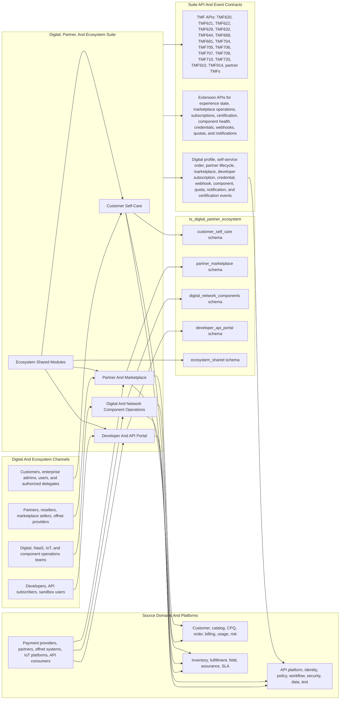
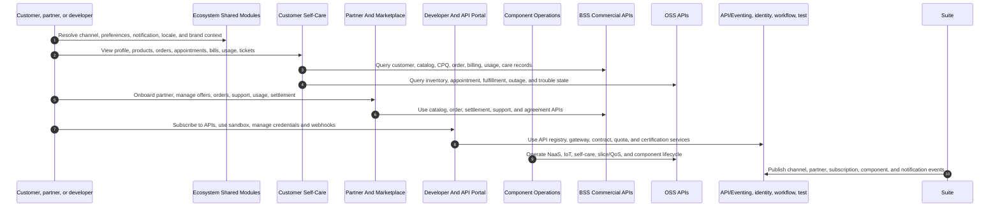
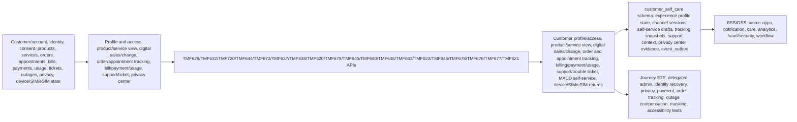
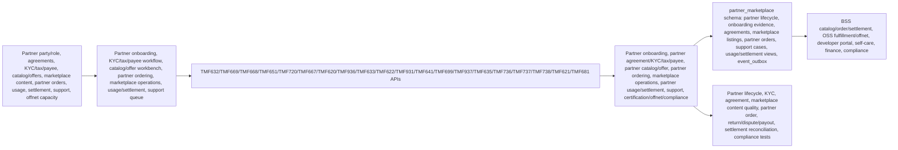
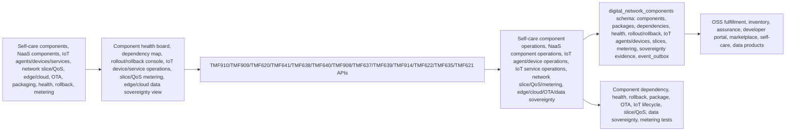
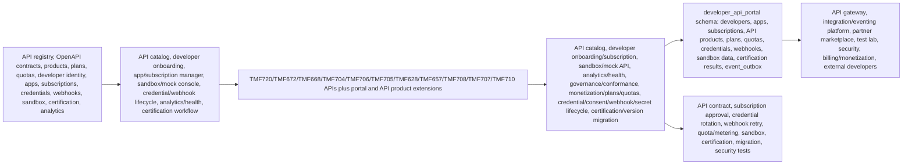
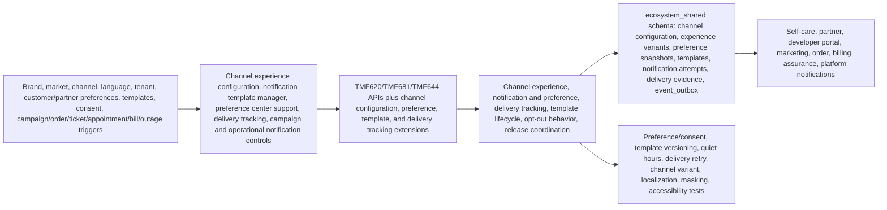

# Digital, Partner, And Ecosystem Architecture Diagrams

Reviewed: 2026-06-14

## Purpose

Use these diagrams when building the Digital, Partner, And Ecosystem suite and its apps. They show how digital channels, partner marketplace operations, developer/API portal, component operations, and shared channel/notification modules consume BSS/OSS/platform APIs while owning their own experience, partner, subscription, credential, component, and notification lifecycle records.

Primary sources:

- [Implementation File Usage Guide](implementation-file-usage-guide.md)
- [Tech And UI Guidance](tech-and-ui-guidance.md)
- [Data Model](data-model.md)
- [Journey Coverage](journey-coverage.md)
- App `implementation-file-usage.md`, `README.md`, `modules-and-features.md`, `personas-and-user-journeys.md`, and `features/` detail packs
- [TMF API To DDL Traceability Matrix](../tmf-api-to-ddl-traceability-matrix.md)
- `database/postgres/suites/ts_digital_partner_ecosystem/`

## Suite Architecture

## Suite Build Flow

## App Architecture: Customer Self-Care

## App Architecture: Partner And Marketplace

## App Architecture: Digital And Network Component Operations

## App Architecture: Developer And API Portal

## App Architecture: Ecosystem Shared Modules

## Build Use

Use these diagrams to keep digital apps honest about source-of-truth boundaries. Customer Self-Care and Partner/Marketplace can own experience and partner workflow state, but customer, order, billing, inventory, fulfillment, and assurance corrections must go back through the owning BSS/OSS APIs.
